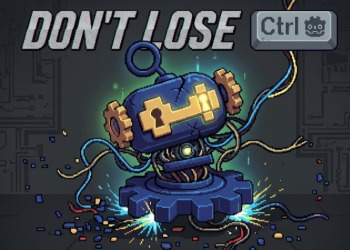
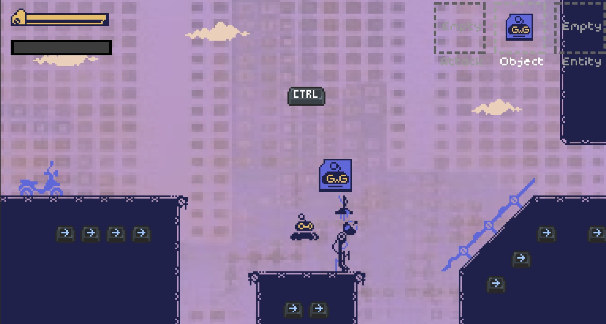
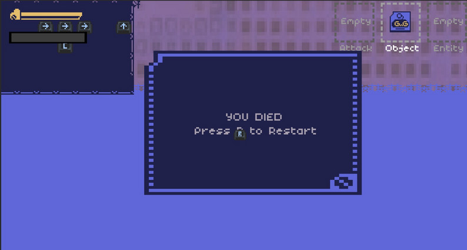
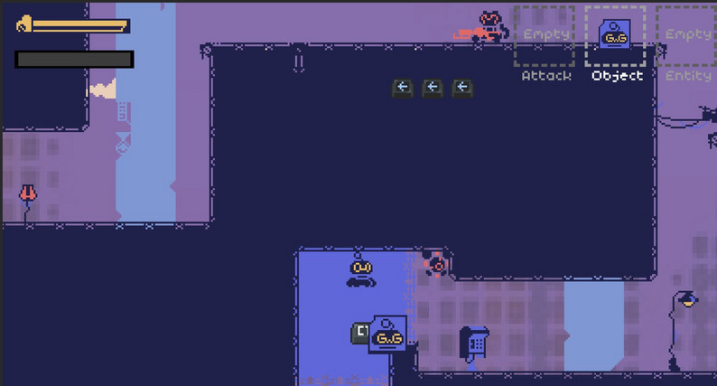
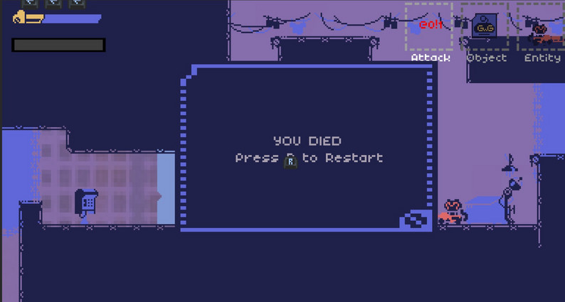
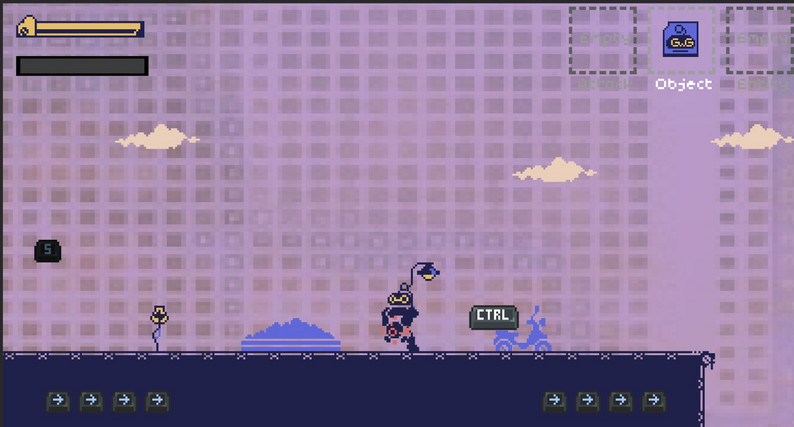

<div align="center">

# Don't Lose CTRL



---

### A 2D puzzle-platformer created during **UM Game Jam 2026**
### *Theme: Losing Control*

<br>


[](LICENSE)
[](https://qwerty2234.itch.io/don-lost-ctrl)

</div>

## 📖 Overview

In a corrupted digital world known as **Kernel-9**, reality is breaking apart after a catastrophic system failure triggered by the **Delete Virus**.

You play as a rogue user-script — an unauthorized process trapped inside the system — with no weapons, no permissions, and only one advantage: the **system clipboard**.

In this world, keyboard shortcuts are not inputs — they are powers.

Survive, manipulate corrupted logic, and recover the lost components of the **Master Shortcut** before reality is fully erased.

---

## 📸 Screenshots
|  |  |  
|---|---|
|   |   |
|   |   | 
|   |  |
---

## 🎮 Gameplay Overview

Inside the digital sector of Kernel-9, the Master Shortcut has been shattered by the Delete virus, corrupting reality itself.

Players control a rogue user-script capable of:
- copying enemies and objects
- pasting cloned entities into the world
- saving world states
- switching between dimensions

Objective: reconstruct the lost **Master Shortcut (C, V, S, Tab)** before system deletion completes.

---

## ⚙️ Core Mechanics

| Key | Mechanic | Description |
|-----|----------|-------------|
| `C` | Copy Strike | Clone projectiles, objects, and enemies into the clipboard |
| `V` | Paste Summon | Spawn copied entities back into the world |
| `Z` | Undo | Remove the oldest active paste and recover RAM |
| `S` | World Save | Save the current world state as a checkpoint |
| `Tab` | Dimension Switch | Swap between corrupted and clean dimensions |

## 🧠 System Mechanics

### The Tether (`CTRL` System)
CTRL follows the player dynamically. Losing connection triggers chaos effects such as:
- gravity may invert
- controls may scramble
- physics becomes unstable
- chaos events are triggered

---

## 🕹️ Controls

| Key | Action |
|---|---|
| `A` / `D` | Move |
| `Space` | Jump |
| `C` | Copy Strike |
| `V` | Paste Summon |
| `Z` | Undo / Free RAM |
| `S` | World Save |
| `Tab` | Dimension Switch |
| `Q` / `E`| Cycle Clipboard Slot |

---

## 🛠️ Tech Stack

| Technology | Purpose |
| :--- | :--- |
| [](https://godotengine.org/) | Game engine (scenes, physics, rendering, systems) |
| [](https://docs.godotengine.org/) | Core gameplay scripting language |
| [](https://www.mapeditor.org/) | Tile-based level design |
| [](https://git-scm.com/) | Version control system |
| [](https://github.com/) | Repository hosting and collaboration |
| [](https://www.anthropic.com/) | AI-assisted design, debugging, documentation |
| [](https://deepmind.google/technologies/gemini/) | AI-assisted brainstorming and explanations |
---

## 📦 Installation

### 1. Clone the repository
```bash
git clone https://github.com/ericlamkf/macamYes-GameJam-2026.git
```

### 2. Install Godot Engine
Download and install the correct version of Godot Engine:
https://godotengine.org/download/windows/

### 3. Open the project
- Launch **Godot Engine**
- Click **Import / Open Project**
- Select the `project.godot` file in the cloned folder

### 4. Run the game
- Press ▶ Play in the editor

---

## 📁 Project Structure

```text
macamYes-GameJam-2026/
├── assets/            # Game assets such as audio, sprites, fonts, and tilesets
│   ├── audio/         # Background music and sound effects
│   ├── sprites/       # Character, enemy, environment, and UI textures
│   ├── fonts/         # Custom fonts used in the UI
│   └── tilesets/      # Tilemaps and environment textures
│
├── scenes/            # Main Godot scenes and gameplay objects
│   ├── player/        # Player scenes, menus, and player-related systems
│   ├── enemies/       # Enemy scenes, AI, and projectile systems
│   ├── objects/       # Interactive world objects and hazards
│   ├── pickups/       # Collectible shortcut entities (C, V, S, Tab, etc.)
│   ├── world/         # Levels, rooms, and environment mechanics
│   └── shared/        # Shared reusable scenes and utilities
│
├── scripts/           # Global gameplay logic and reusable scripts
│   ├── global/        # Persistent game state and singleton systems
│   ├── resources/     # Custom resource definitions and clipboard data
│   └── world/         # Checkpoints, level exits, and world interactions
│
├── resources/         # Runtime save data and gameplay resources
├── snapshots/         # Development snapshots and backups
│
├── README.md          # Project overview and documentation
├── CREDITS.txt        # Third-party asset and audio attributions
└── project.godot      # Godot project configuration
```

---

## ©️ Credits

### 🎵 Audio
- "health.wav" by Shades  
  https://soundcloud.com/noshades

### 🧩 Assets
- Pixxxelpunkkk Toolkit by Venoxxx  
  https://venoxxx.itch.io/pixxxelpunkkk-toolkit

---

## 🚧 Future Improvements

While the core gameplay is functional, several systems can be expanded or refined in future iterations:

### Gameplay Systems
- [ ] Add start / main menu screen flow  
- [ ] Improve clarity of Copy / Paste interactions for new players  
- [ ] Improve input responsiveness and control feel  
- [ ] Add clearer visual feedback for clipboard state  
- [ ] Balance Chaos Events for fair difficulty progression  

### CTRL Tether System
- [ ] Improve UI readability of CTRL connection state  
- [ ] Reduce excessive randomness in control disruption effects  
- [ ] Add recovery mechanics beyond simple reconnection  

### Technical Improvements
- [ ] Optimize entity cloning system for performance stability  
- [ ] Refactor clipboard logic into modular components  
- [ ] Improve save/load system reliability across levels  

### Polish
- [ ] Improve UI hierarchy for system messages  
- [ ] Enhance readability of screen distortion effects  
- [ ] Improve audio feedback consistency for system states  

---

<div align="center">Created by Team Macam Yes 2026</div>
